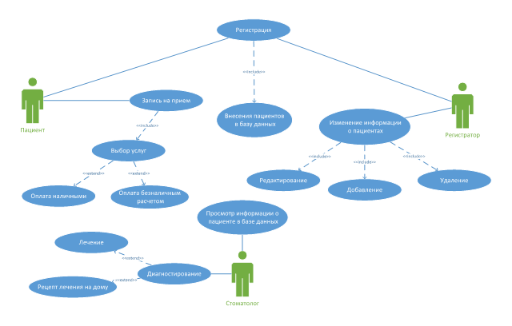
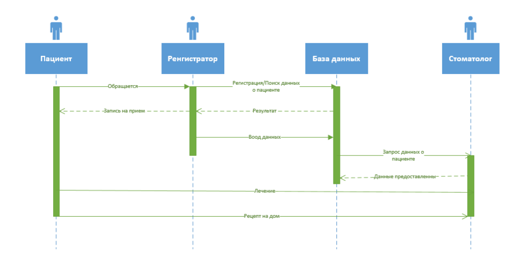
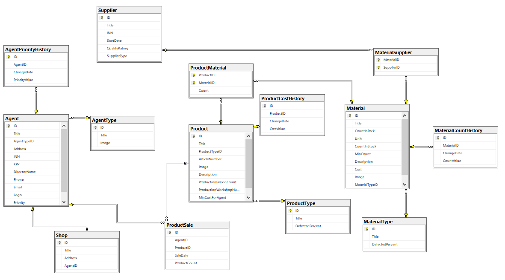
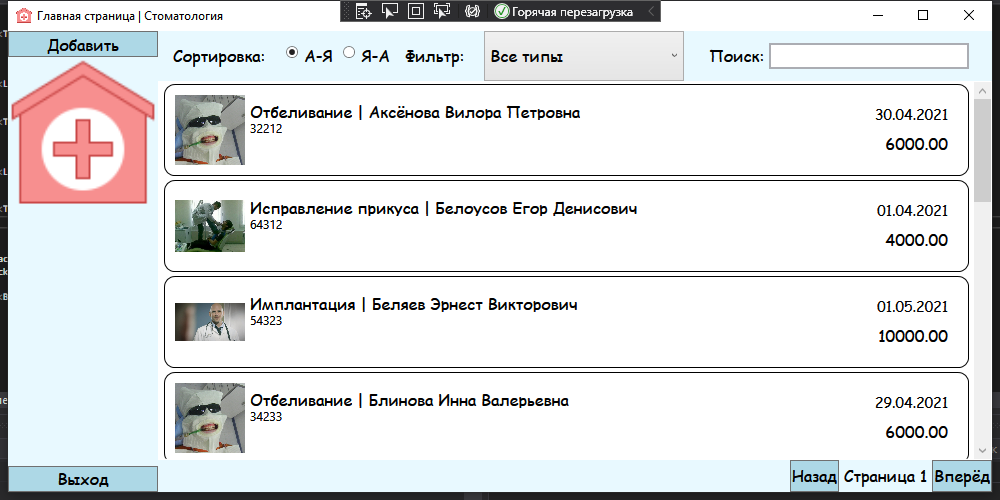
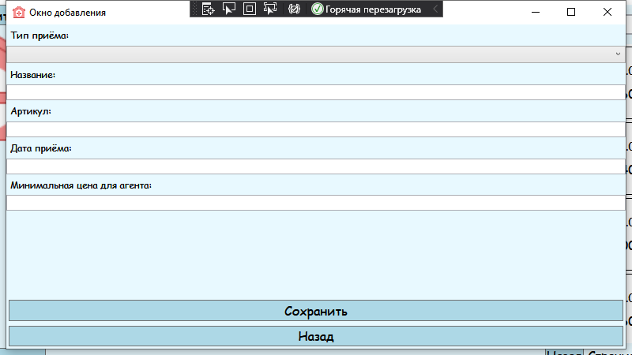
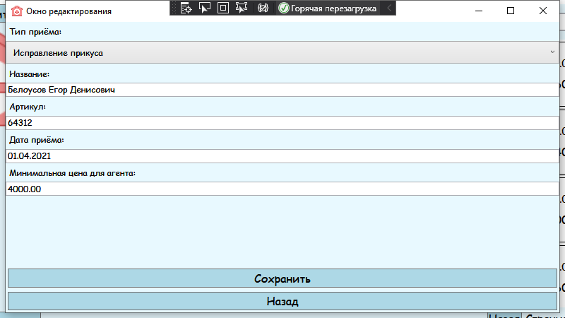

<table style="width: 100%;">
  <tr>
    <td style="text-align: center; border: none;"> 
        Министерство образования и науки РФ <br/>
        ГБПОУ РМЭ "Йошкар-Олинский Технологический колледж 
    </td>
  </tr>
  <tr>
    <td style="text-align: center; border: none; height: 45em;">
        <h2>
            Курсовой проект <br/>
            "Проектирование и разработка информационных систем" <br/>
            группа И-41
        <h2>
    </td>
  </tr>
  <tr>
    <td style="text-align: right; border: none; height: 20em;">
        <div style="float: right;" align="left">
            <b>Разработал</b>: <br/>
            Жмакин М.В.<br/>
        </div>
    </td>
  </tr>
  <tr>
    <td style="text-align: center; border: none; height: 1em;">
        г.Йошкар-Ола, 2021
    </td>
  </tr>
</table>

<div style="page-break-after: always;"></div>

# Содержание

* [Введение](#Введение)
* [Структурный системный анализ](#Структурный-системный-анализ)
* [Разработка и реализация проекта базы данных](#Разработка-и-реализация-проекта-базы-данных)
* [Практическая часть](#Практическая-часть)
* [Заключение](#Заключение)

# Введение

В современном мире поток информации с каждым годом все увеличивается, тем самым человеку становится все сложнее его правильно и качественно обрабатывать и фильтровать. Это обусловлено резким скачком роста населения Земли в связи с повышением качества жизни, людей становится больше, следовательно как и информации. Но самая главная причина – конечно же изобретение ЭВМ (Электронно-вычислительная машина) технология которую из года в год человек развивал так, что современные компьютеры во многом превосходят человеческий мозг в продуктивности.

В нашей стране и за рубежом активно разрабатываются и внедряются информационные системы в здравоохранении. Одним из направлений является развитие информационных систем в стоматологии. Создание эффективной информационной системы стоматологического медицинского учреждения подразумевает объединение в общее информационное пространство регистрации случаев заболевания и лечения пациентов. В то же время необходимо учитывать как услуги, выполненные по системе обязательного медицинского страхования, так и платные услуги.

Для описания предметной области и проектируемой системы будем использовать диаграммы UML. Язык моделирования UML предоставляет выразительные средства для создания визуальных моделей и обладает рядом значимых преимуществ:

•	UML объектно-ориентирован, в результате чего методы описания результатов анализа и проектирования семантически близки к методам программирования на современных объектно-ориентированных языках;

•	UML позволяет описать систему практически со всех возможных точек зрения и разные аспекты поведения системы;

•	Диаграммы UML сравнительно просты для чтения после быстрого ознакомления с его синтаксисом;

•	UML получил широкое распространение и динамично развивается.

	Актуальность темы в том, что человек неспособен качественно обрабатывать большое количество информации, которая в современном мире стала важным элементом в жизни общества и полноценным ресурсом производства. Из этого можно сделать вывод что, одной из актуальных проблем многих видов человеческой деятельности является проблема обработки увеличивающегося с каждым годом потока информации. Перспективным решением этой проблемы частичная или полная автоматизация работы с информацией. Внедрение информационных технологий станет важным этапом в оптимизации внутренних процессов организации, оперативного доведения информации до исполнителей, улучшения взаимодействия подразделений и отдельных исполнителей в процессе работы с документами, контроля исполнения документов и поручений, поиска информации и определения стадии исполнения документов и их местонахождения, то есть, в конечном счете, способствует более оперативному и качественному выполнения поставленных задач.

Цель данной курсовой работы - повышение эффективности работы регистратора стоматологии путем разработки и внедрения базы данных, содержащую сведения о пациентах стоматологической поликлиники “Дантистъ” в городе Йошкар-Ола  

Данная информационная система предназначена для хранения информации о пациентах, которым были оказаны услуги и о произведенных оплатах с возможностью внесения данных, выборки и изменения данных, вывода информации в необходимом формате. 


	Объектом исследования является стоматология “Дантистъ” в городе Йошкар-Ола а предмет исследования - информационная система, автоматизирующая работу регистратора стоматологической клиники.

	задачи исследования:

1.	 Изучить теоретические основы проектирования базы данных

2.	На основе теоретического анализа литературы и интернет - источников произвести анализ предметной области общежитие.

3.	Провести	функционально-ориентированное	проектирование информационной системы. Описать и изучить предметную область

4.	Разработать инфологическую модель информационной системы.

5.	Спроектировать логическую структуру информационной системы.

6.	Разработать физическую структуру информационной системы.

7.	Разработать запросы и отчеты к информационной системе.

8.	Спроектировать базу данных "Стоматологическая клиника"

9.	Разработать интерфейс БД. 

10.	Создать руководство пользователя.


# Структурный системный анализ

1.1.Описание предметной области

Несмотря на то, что Персональные компьютеры есть не во всех сферах общества и не даже не во всех домах, уже сейчас можно заметить, как быстрым темпом идет автоматизация многих предприятий в различных отраслях. Например - современные стоматологические клиники. Они отличаются от тех что мы привыкли видеть 10 или 20 лет назад. Больше никаких длинный очередей. связано это непосредственно с внедрением ИС в медицину. Записываться на прием можно через интернет на предназначенных для этого сайтах. Вся указываемая пациентом информация находится в базе данных клиники.

Данная база данных предназначается для регистратора он будет вводить данные о клиентах и записывать их на прием.

Регистратору будет предложено заполнять все документы через специальные экранные шаблоны. Вывод результатной информации будет осуществляться так же с помощью экранных шаблонов, структура которых максимально приближена к первичным документам. Регистратору будет удобно и оперативно вносить изменения в базу данных. Сумма по оказанным услугам будет подсчитывать автоматически, и правильно. Регистратору не нужно будет больше подсчитывать сумму самостоятельно, что так же позволит избежать дополнительных ошибок. Так же с отчетом в конце дня по оказанным услугам и ежемесячные отчеты по услугам организациям. Такие отчеты занимали много времени и сил всего персонала, регистратору не придется больше самостоятельно подсчитывать сумму услуг. 

Для приема и регистрации медицинских услуг в стоматологии имеется отдел по вводу и обработке данных выполненных объемов медицинской помощи, возглавляемый начальником, который осуществляет контроль над работой отдела обработки данных и вместе с руководителем медицинского учреждения несет ответственность за правильную организацию работы, а также четкое медицинское обслуживание клиентов частной стоматологии.

При разработке информационной системы для стоматологии было проведено обследование её деятельности по следующим источникам:

–	регистраторам стоматологии были предоставлены необходимые нормативные документы по правилам заполнения бланков содержащих информации о пациентах - журнал, содержащий информацию о результатах прошлых посещениях пациентов и выбранные ими услуги

–	литература и интернет-источники, описывающие работу других стоматологий.

При обследования предметной области были выявлены следующие входные данные:

–	информация о пациентах,

–	информация о заполнении бланков с информацией о пациентах

–	информация о платежах,

–	информация о результатах прошлых посещений и выбранных ими услугах.

К выходным данным относятся отчеты об оплатах за услуги стоматологии, сведения о самих стоматологах, сведения о свободных и занятых записях на прием.

Отчеты сформированные с помощью базы данным предназначены для руководства клиники, а также ежемесячного отчета организациям, с которыми заключены договоры.

Для создания информационной модели стоматологии необходимо осуществить формальное описание его работы. Изучение руководящих документов является первым шагом в изучении процессов её работы. Затем, на основе эталонных знаний, исследуется реальная работа регистрации в стоматологии и сравнивается с указанием руководящих документов. Многократное изучение руководящих документов, периодическое наблюдение за реальными действиями регистратора и комментарии этого работника позволяют получить знания о функционировании работы стоматологии и разработать модели.

Пациент обращается в стоматологию по телефонному звонку или приходит сам в стоматологию. Далее регистратор проверяет наличие информации о пациенте в журнале. Такой процесс поиска данных связан с большой проверкой бумажных документов что занимает немалое количество времени. Целью решения данной задачи является сведение к минимуму работы регистратуры с бумажными носителями, что ускорит процесс обработки поступающей информации, сократив время ожидания для пациента, исключит возможную путаницу информации

1.2 Разработка функциональной модели информационной системы

Функциональная модель предназначена для описания существующих бизнес-процессов на предприятии.

Первая фаза процесса проектирования базы данных называется концептуальным проектированием базы данных. Она заключается в создании концептуальной модели данных для анализируемой части предприятия. Концептуальное проектирование базы данных абсолютно не зависит от таких подробностей ее реализации, как тип выбранной целевой СУБД, набор создаваемых прикладных программ, используемые языки программирования, тип выбранной вычислительной платформы, а также от любых других особенностей физической реализации.. Созданная концептуальная модель данных предприятия является источником информации для фазы логического проектирования базы данных.

 Диаграмма вариантов использования в UML — диаграмма, отражающая отношения между акторами и прецедентами и являющаяся составной частью модели прецедентов она поможет описать систему на концептуальном уровне.

При моделировании системы с помощью диаграммы прецедентов системный аналитик стремится:

•	чётко отделить систему от её окружения;

•	определить действующих лиц (акторов), их взаимодействие с системой и ожидаемую функциональность системы;

•	определить в глоссарии предметной области понятия, относящиеся к детальному описанию функциональности системы (то есть прецедентов).

Функциональная модель системы создавалась с использованием диаграммы прецедентов (Use Case Diagram). Данная диаграмма имеет следующие прецеденты:

- Регистрация

- Внесение в базу данных

- Просмотр данных в базе

### Диаграмма UseCase:

### Диаграмма последовательности:


# Разработка и реализация проекта базы данных

ER-модель (от англ. Entity-Relationship model, модель «сущность — связь») — модель данных, позволяющая описывать концептуальные схемы предметной области.

ER-модель используется при высокоуровневом (концептуальном) проектировании баз данных. С её помощью можно выделить ключевые сущности и обозначить связи, которые могут устанавливаться между этими сущностями.

Во время проектирования баз данных происходит преобразование схемы, созданной на основе ER-модели, в конкретную схему базы данных на основе выбранной модели данных (реляционной, объектной, сетевой или др.).

ER-модель представляет собой формальную конструкцию, которая сама по себе не предписывает никаких графических средств её визуализации. В качестве стандартной графической нотации, с помощью которой можно визуализировать ER-модель, была предложена диаграмма «сущность-связь» (англ. Entity-Relationship diagram, ERD, ER-диаграмма).

Понятия «ER-модель» и «ER-диаграмма» часто не различают, хотя для визуализации ER-моделей могут быть использованы и другие графические нотации, либо визуализация может вообще не применяться (например, использоваться текстовое описание).

Модель была предложена в 1976 году Питером Ченом, им же предложена и самая популярная графическая нотация для модели.

Схема «сущность-связь» (также ERD или ER-диаграмма) — это разновидность блок-схемы, где показано, как разные «сущности» (люди, объекты, концепции и так далее) связаны между собой внутри системы. ER-диаграммы чаще всего применяются для проектирования и отладки реляционных баз данных в сфере образования, исследования и разработки программного обеспечения и информационных систем для бизнеса. ER-диаграммы (или ER-модели) полагаются на стандартный набор символов, включая прямоугольники, ромбы, овалы и соединительные линии, для отображения сущностей, их атрибутов и связей. Эти диаграммы устроены по тому же принципу, что и грамматические структуры: сущности выполняют роль существительных, а связи — глаголов.

Символы и способы нотации ERD.

Диаграммы «сущность-связь» (или ERD) — неотъемлемая составляющая процесса моделирования любых систем, включая простые и сложные базы данных, однако применяемые в них фигуры и способы нотации могут запросто ввести в заблуждение любого. Это руководство поможет вам стать настоящим экспертом по нотации ER-диаграмм и уверенно взяться за моделирование собственных баз данных!

Концептуальные модели данных дают общее представление о том, что должно входить в состав модели. Концептуальные ER-диаграммы можно брать за основу логических моделей данных. 

### ERD:


# Практическая часть
## Программирование

### Данное приложение было разработано в программе Visual Studio.

### Язык програмирования: C#

### В приложение реализованно редактирование товара(двойной клик по товару), реализовано удаление(правый клик по товару).

#### Главное окно:


##### Код разметки окна:
```xml
<Window x:Class="Dantist.MainWindow"
        xmlns="http://schemas.microsoft.com/winfx/2006/xaml/presentation"
        xmlns:x="http://schemas.microsoft.com/winfx/2006/xaml"
        xmlns:d="http://schemas.microsoft.com/expression/blend/2008"
        xmlns:mc="http://schemas.openxmlformats.org/markup-compatibility/2006"
        xmlns:local="clr-namespace:Dantist"
        mc:Ignorable="d"
        Title="Главная страница | Стоматология" 
        WindowStartupLocation="CenterScreen"
        Height="500" Width="1000">
    <Grid Background="#FFE8F9FF">
        <Grid.ColumnDefinitions>
            <ColumnDefinition Width="150"/>
            <ColumnDefinition Width="*"/>
        </Grid.ColumnDefinitions>

        <StackPanel 
            Orientation="Vertical"
            VerticalAlignment="Top"
            Width="150">
            <Button 
                x:Name="AddButton"
                Content="Добавить"
                Click="AddButton_Click"
                VerticalAlignment="Top"
                Background="LightBlue" 
                FontFamily="Comic Sans MS" 
                FontSize="16"/>
            
            <Image Source="/icons8-больница-3-80.ico" />

        </StackPanel>
        <Button  
            x:Name="Exit" 
            Content="Выход" 
            Click="Exit_Click" 
            VerticalAlignment="Bottom"
            Background="LightBlue" 
            FontFamily="Comic Sans MS" 
            FontSize="16"/>

        <Grid Grid.Column="1">
            <Grid.RowDefinitions>
                <RowDefinition Height="auto"/>
                <RowDefinition Height="*"/>
                <RowDefinition Height="auto"/>
            </Grid.RowDefinitions>

            <WrapPanel 
                Orientation="Horizontal"
                ItemHeight="50">

                <Label 
                    Content="Сортировка: "
                    Margin="10,0,10,0"
                    VerticalAlignment="Center" 
                    FontFamily="Comic Sans MS" 
                    FontSize="16"/>

                <RadioButton
                    GroupName="Rooms"
                    Tag="1"
                    Content="А-Я"
                    IsChecked="True"
                    Checked="RadioButton_Checked"
                    VerticalAlignment="Center"
                    Margin="0 0 10 0" 
                    FontFamily="Comic Sans MS" 
                    FontSize="16"/>
                <RadioButton
                    GroupName="Rooms"
                    Tag="2"
                    Content="Я-А"
                    Checked="RadioButton_Checked"
                    VerticalAlignment="Center" 
                    FontFamily="Comic Sans MS" 
                    FontSize="16"/>

                <Label 
                    Content="Фильтр: "
                    Margin="10,0,10,0"
                    VerticalAlignment="Center" 
                    FontFamily="Comic Sans MS" 
                    FontSize="16"/>

                <ComboBox
                    x:Name="FilterTypeComboBox"
                    SelectedIndex="0"
                    VerticalContentAlignment="Center"
                    MinWidth="200"
                    MinHeight="10"
                    SelectionChanged="FilterTypeComboBox_SelectionChanged"
                    ItemsSource="{Binding ProductTypeList}" 
                    FontFamily="Comic Sans MS" 
                    FontSize="16">
                    <ComboBox.ItemTemplate>
                        <DataTemplate>
                            <TextBlock Text="{Binding Title}"  FontFamily="Comic Sans MS" FontSize="16"/>
                        </DataTemplate>
                    </ComboBox.ItemTemplate>
                </ComboBox>


                <Label 
                    Margin="20 0 0 0"
                    Content="Поиск:" 
                    VerticalAlignment="Center" 
                    FontFamily="Comic Sans MS" 
                    FontSize="16"/>
                <TextBox
                    Width="200"
                    VerticalAlignment="Center"
                    x:Name="SearchFilterTextBox" 
                    KeyUp="SearchFilter_KeyUp"
                    BorderThickness="2"
                    FontFamily="Comic Sans MS" 
                    FontSize="16"/>
            </WrapPanel>

            <ListView
                Grid.Row="1"
                ItemsSource="{Binding ProductList}"
                x:Name="ProductListView"
                BorderThickness="0"
                MouseDoubleClick="ProductListView_MouseDoubleClick">

                <ListView.ContextMenu>
                    <ContextMenu>
                        <MenuItem  FontFamily="Comic Sans MS" FontSize="16" Header="Удалить" x:Name="DeleteButton" Click="DeleteButton_Click"/>
                    </ContextMenu>
                </ListView.ContextMenu>

                <ListView.ItemContainerStyle>
                    <Style TargetType="ListViewItem">
                        <Setter
                            Property="HorizontalContentAlignment"
                            Value="Stretch" />
                    </Style>
                </ListView.ItemContainerStyle>

                <ListView.ItemTemplate>
                    <DataTemplate>
                        <Border 
                            BorderThickness="1" 
                            BorderBrush="Black" 
                            CornerRadius="10">
                            <Grid 
                                Margin="10"
                                HorizontalAlignment="Stretch">
                                <Grid.ColumnDefinitions>
                                    <ColumnDefinition Width="70"/>
                                    <ColumnDefinition Width="*"/>
                                    <ColumnDefinition Width="100"/>
                                </Grid.ColumnDefinitions>

                                <Image
                                    Width="70" 
                                    Height="70"
                                    Source="{Binding Path=ImagePreview}" />

                                <Grid Grid.Column="1" Margin="5">
                                    <Grid.RowDefinitions>
                                        <RowDefinition Height="20"/>
                                        <RowDefinition Height="20"/>
                                        <RowDefinition Height="*"/>
                                    </Grid.RowDefinitions>

                                    <StackPanel Orientation="Horizontal">
                                        <TextBlock Text="{Binding ProductType.Title}" 
                    FontFamily="Comic Sans MS" 
                    FontSize="16" />
                                        <TextBlock Text=" | " 
                    FontFamily="Comic Sans MS" 
                    FontSize="16" />
                                        <TextBlock Text="{Binding Title}" 
                    FontFamily="Comic Sans MS" 
                    FontSize="16" />
                                    </StackPanel>

                                    <TextBlock 
                                        Text="{Binding ArticleNumber}"
                                        Grid.Row="1"/>
                                </Grid>

                                <TextBlock 
                                    Text="{Binding DatePriem}"
                                    Grid.Column="2"
                                    VerticalAlignment="Top"
                                    HorizontalAlignment="Right"
                                    Margin="10" 
                    FontFamily="Comic Sans MS" 
                    FontSize="14"/>

                                <TextBlock 
                                    Text="{Binding MinCostForAgent}"
                                    Grid.Column="2"
                                    VerticalAlignment="Bottom"
                                    HorizontalAlignment="Right"
                                    Margin="10" 
                    FontFamily="Comic Sans MS" 
                    FontSize="16"/>

                            </Grid>
                        </Border>
                    </DataTemplate>
                </ListView.ItemTemplate>

            </ListView>

            <StackPanel
                Grid.Row="2"
                HorizontalAlignment="Right" 
                Orientation="Horizontal">
                <Button 
                    Content="Назад" 
                    Name="PrevPage"
                    Click="PrevPage_Click"
                    Background="LightBlue" 
                    FontFamily="Comic Sans MS" 
                    FontSize="16"/>
                <TextBlock 
                    Text="{Binding CurrentPage, StringFormat=Страница {0}}"
                    VerticalAlignment="Center"
                    Margin="5" 
                    FontFamily="Comic Sans MS" 
                    FontSize="16"/>
                <Button
                    Content="Вперёд"
                    Name="NextPage"
                    Click="NextPage_Click"
                    Background="LightBlue" 
                    FontFamily="Comic Sans MS" 
                    FontSize="16"/>
            </StackPanel>
        </Grid>

    </Grid>
 </Window>


```
##### Логика главного окна:

```cs
using System;
using System.Collections.Generic;
using System.ComponentModel;
using System.Linq;
using System.Text;
using System.Threading.Tasks;
using System.Windows;
using System.Windows.Controls;
using System.Windows.Data;
using System.Windows.Documents;
using System.Windows.Input;
using System.Windows.Media;
using System.Windows.Media.Imaging;
using System.Windows.Navigation;
using System.Windows.Shapes;

namespace Dantist
{
    /// <summary>
    /// Логика взаимодействия для MainWindow.xaml
    /// </summary>
    public partial class Product
    {
        public Uri ImagePreview
        {
            get
            {
                var imageName = Environment.CurrentDirectory + Image ?? "";
                return System.IO.File.Exists(imageName) ? new Uri(imageName) : new Uri("pack://application:,,,/picture.png");
            }
        }
    }
    public partial class MainWindow : Window, INotifyPropertyChanged
    {

        private IEnumerable<Product> _ProductList;

        private int _CurrentPage = 1;

        public event PropertyChangedEventHandler PropertyChanged;

        public int CurrentPage
        {
            get
            {
                return _CurrentPage;
            }
            set
            {
                if (value > 0)
                {
                    if ((_ProductList.Count() % 10) == 0)
                    {
                        if (value <= _ProductList.Count() / 10)
                        {
                            _CurrentPage = value;
                            Invalidate();
                        }
                    }
                    else
                    {
                        if (value <= (_ProductList.Count() / 10) + 1)
                        {
                            _CurrentPage = value;
                            Invalidate();
                        }
                    }
                }
            }
        }

        private string _SearchFilter = "";
        public string SearchFilter
        {
            get
            {
                return _SearchFilter;
            }
            set
            {
                _SearchFilter = value;
                if (PropertyChanged != null)
                {
                    PropertyChanged(this, new PropertyChangedEventArgs("ProductList"));
                }
            }
        }

        private void SearchFilter_KeyUp(object sender, KeyEventArgs e)
        {
            SearchFilter = SearchFilterTextBox.Text;
            Invalidate();
        }

        private bool _SortList = true;
        public bool SortList
        {
            get
            {
                return _SortList;
            }
            set
            {
                _SortList = value;
                if (PropertyChanged != null)
                {
                    PropertyChanged(this, new PropertyChangedEventArgs("ProductList"));
                }
            }
        }

        private void RadioButton_Checked(object sender, RoutedEventArgs e)
        {
            SortList = (sender as RadioButton).Tag.ToString() == "1";
        }

        private void Invalidate()
        {
            PropertyChanged?.Invoke(this, new PropertyChangedEventArgs("ProductList"));
            PropertyChanged?.Invoke(this, new PropertyChangedEventArgs("CurrentPage"));
        }

        public IEnumerable<Product> ProductList
        {
            get
            {
                var Result = _ProductList;

                if (_ProductTypeFilterValue > 0)
                    Result = Result.Where(ai => ai.ProductTypeID == _ProductTypeFilterValue);

                if (SearchFilter != "")
                    Result = Result.Where(ai => ai.Title.IndexOf(SearchFilter, StringComparison.OrdinalIgnoreCase) >= 0);

                if (SortList) Result = Result.OrderBy(ai => ai.Title);
                else Result = Result.OrderByDescending(ai => ai.Title);

                return Result.Skip((CurrentPage - 1) * 10).Take(10);


            }
            set
            {
                _ProductList = value;

                if (PropertyChanged != null)
                {
                    PropertyChanged(this, new PropertyChangedEventArgs("ProductList"));
                }
            }
        }

        public IEnumerable<Product> ProductsList
        {
            get
            {
                var Result = _ProductList;

                if (SearchFilter != "")
                    Result = Result.Where(ai => ai.Title.IndexOf(SearchFilter, StringComparison.OrdinalIgnoreCase) >= 0);

                return Result;
            }
            set
            {
                _ProductList = value;
            }
        }

        public List<ProductType> ProductTypeList { get; set; }

        private int _ProductTypeFilterValue = 0;
        public int ProductTypeFilterValue
        {
            get
            {
                return _ProductTypeFilterValue;
            }
            set
            {
                _ProductTypeFilterValue = value;
                if (PropertyChanged != null)
                {
                    PropertyChanged(this, new PropertyChangedEventArgs("ProductList"));
                }
            }
        }
        public MainWindow()
        {
            InitializeComponent();
            DataContext = this;
            ProductList = Core.DB.Product.ToArray();
            ProductTypeList = Core.DB.ProductType.ToList();
            ProductTypeList.Insert(0, new ProductType { Title = "Все типы" });
        }


        private void Exit_Click(object sender, RoutedEventArgs e)
        {
            Application.Current.Shutdown();
        }

        private void PrevPage_Click(object sender, RoutedEventArgs e)
        {
            CurrentPage--;
        }

        private void NextPage_Click(object sender, RoutedEventArgs e)
        {
            CurrentPage++;
        }

        private void AddButton_Click(object sender, RoutedEventArgs e)
        {
            var addWindow = new AddWindow(new Product());
            if (addWindow.ShowDialog() == true)
            {
                ProductList = Core.DB.Product.ToArray();
            }

        }

        private void ProductListView_MouseDoubleClick(object sender, System.Windows.Input.MouseButtonEventArgs e)
        {
            var EditTourWindow = new EditWindow(ProductListView.SelectedItem as Product);
            if (EditTourWindow.ShowDialog() == true)
            {
                ProductList = Core.DB.Product.ToArray();
            }
        }

        private void RefreshButton_Click(object sender, RoutedEventArgs e)
        {
            var w = new MainWindow();
            w.Show();

            this.Close();
        }

        private void DeleteButton_Click(object sender, RoutedEventArgs e)
        {
            var DeleteProduct = ProductListView.SelectedItem as Product;
            try
            {
                Core.DB.Product.Remove(DeleteProduct);
                Core.DB.SaveChanges();

                MessageBox.Show($"Удалено!");

                ProductList = Core.DB.Product.ToArray();

                if (PropertyChanged != null)
                {
                    PropertyChanged(this, new PropertyChangedEventArgs("ProductList"));
                }
            }
           catch (Exception ex)
            {
                MessageBox.Show($"Ошибка: {ex.Message}");
            }

        }

        private void FilterTypeComboBox_SelectionChanged(object sender, SelectionChangedEventArgs e)
        {
            ProductTypeFilterValue = (FilterTypeComboBox.SelectedItem as ProductType).ID;
        }
    }
}


```

#### Окно добавления и редактирования:


##### Код разметки окна:
```xml
    <Window x:Class="Dantist.AddWindow"
        xmlns="http://schemas.microsoft.com/winfx/2006/xaml/presentation"
        xmlns:x="http://schemas.microsoft.com/winfx/2006/xaml"
        xmlns:d="http://schemas.microsoft.com/expression/blend/2008"
        xmlns:mc="http://schemas.openxmlformats.org/markup-compatibility/2006"
        xmlns:local="clr-namespace:Dantist"
        mc:Ignorable="d"
        Title="Окно добавления"
        WindowStartupLocation="CenterScreen"
        Height="450" Width="800">
    <Grid Background="#FFE8F9FF">
        <StackPanel>
            <Label Content="Тип приёма:"
                    FontFamily="Comic Sans MS" />
            <ComboBox
                ItemsSource="{Binding ProductTypes}"
                SelectedItem="{Binding CurrentProduct.ProductType}"
                    FontFamily="Comic Sans MS" >
                <ComboBox.ItemTemplate>
                    <DataTemplate>
                        <Label Content="{Binding Title}"
                    FontFamily="Comic Sans MS" />
                    </DataTemplate>
                </ComboBox.ItemTemplate>
            </ComboBox>
            <Label 
                Content="Название:"
                    FontFamily="Comic Sans MS" />
            <TextBox 
                Height="20"
                Text="{Binding CurrentProduct.Title}"
                    FontFamily="Comic Sans MS" />
            <Label 
                Content="Артикул:"
                    FontFamily="Comic Sans MS" />
            <TextBox 
                Height="20" 
                Text="{Binding CurrentProduct.ArticleNumber}"
                    FontFamily="Comic Sans MS" />
            <Label 
                Content="Дата приёма:"
                    FontFamily="Comic Sans MS" />
            <TextBox 
                Height="20"
                Text="{Binding CurrentProduct.DatePriem}"
                    FontFamily="Comic Sans MS" />
            <Label 
                Content="Минимальная цена для агента:"
                    FontFamily="Comic Sans MS" />
            <TextBox 
                Height="20"
                Text="{Binding CurrentProduct.MinCostForAgent}"
                    FontFamily="Comic Sans MS" />
        </StackPanel>
        <StackPanel VerticalAlignment="Bottom">

            <Button
                x:Name="SaveButton" 
                Content="Сохранить"
                Click="SaveButton_Click"
                Margin="3"
                Background="LightBlue" 
                FontFamily="Comic Sans MS" 
                FontSize="16"/>
            <Button 
                x:Name="BackButton"
                Content="Назад"
                Click="BackButton_Click"
                Margin="3"
                Background="LightBlue" 
                FontFamily="Comic Sans MS" 
                FontSize="16"/>
        </StackPanel>
    </Grid>
 </Window>
```
##### Логика данного окна:

```cs
using System;
using System.Collections.Generic;
using System.Linq;
using System.Text;
using System.Threading.Tasks;
using System.Windows;
using System.Windows.Controls;
using System.Windows.Data;
using System.Windows.Documents;
using System.Windows.Input;
using System.Windows.Media;
using System.Windows.Media.Imaging;
using System.Windows.Shapes;

namespace Dantist
{
    /// <summary>
    /// Логика взаимодействия для AddWindow.xaml
    /// </summary>
    public partial class AddWindow : Window
    {
        public Product CurrentProduct { get; set; }
        public IEnumerable<ProductType> ProductTypes { get; set; }


        public AddWindow(Product products)
        {
            InitializeComponent();
            DataContext = this;
            CurrentProduct = products;
            ProductTypes = Core.DB.ProductType.ToArray();
        }
        private void SaveButton_Click(object sender, RoutedEventArgs e)
        {
            try
            {
                if (CurrentProduct.ID == 0)
                    Core.DB.Product.Add(CurrentProduct);

                Core.DB.SaveChanges();

                DialogResult = true;

                MessageBox.Show($"Успешно!");
            }
            catch
            {
                MessageBox.Show($"Error" +
                    $"Проверьте введённые данные");
            }
        }

        private void BackButton_Click(object sender, RoutedEventArgs e)
        {
            this.Close();
        }
    }
}
```
#### Окно добавления и редактирования:


##### Код разметки окна:
```xml
    <Window x:Class="Dantist.EditWindow"
        xmlns="http://schemas.microsoft.com/winfx/2006/xaml/presentation"
        xmlns:x="http://schemas.microsoft.com/winfx/2006/xaml"
        xmlns:d="http://schemas.microsoft.com/expression/blend/2008"
        xmlns:mc="http://schemas.openxmlformats.org/markup-compatibility/2006"
        xmlns:local="clr-namespace:Dantist"
        mc:Ignorable="d"
        Title="Окно редактирования"
        Height="450" Width="800"
        WindowStartupLocation="CenterScreen">
    <Grid Background="#FFE8F9FF">
        <StackPanel>
            <Label Content="Тип приёма:"
                    FontFamily="Comic Sans MS" />
            <ComboBox
                ItemsSource="{Binding ProductTypes}"
                SelectedItem="{Binding CurrentProduct.ProductType}"
                    FontFamily="Comic Sans MS" >
                <ComboBox.ItemTemplate>
                    <DataTemplate>
                        <Label Content="{Binding Title}"
                    FontFamily="Comic Sans MS" />
                    </DataTemplate>
                </ComboBox.ItemTemplate>
            </ComboBox>
            <Label 
                Content="Название:"
                    FontFamily="Comic Sans MS" />
            <TextBox 
                Height="20"
                Text="{Binding CurrentProduct.Title}"
                    FontFamily="Comic Sans MS" />
            <Label 
                Content="Артикул:"
                    FontFamily="Comic Sans MS" />
            <TextBox 
                Height="20" 
                Text="{Binding CurrentProduct.ArticleNumber}"
                    FontFamily="Comic Sans MS" />
            <Label 
                Content="Дата приёма:"
                    FontFamily="Comic Sans MS" />
            <TextBox 
                Height="20"
                Text="{Binding CurrentProduct.DatePriem}"
                    FontFamily="Comic Sans MS" />
            <Label 
                Content="Минимальная цена для агента:"
                    FontFamily="Comic Sans MS" />
            <TextBox 
                Height="20"
                Text="{Binding CurrentProduct.MinCostForAgent}"
                    FontFamily="Comic Sans MS" />
        </StackPanel>
        <StackPanel VerticalAlignment="Bottom">

            <Button
                x:Name="SaveButton" 
                Content="Сохранить"
                Click="SaveButton_Click"
                Margin="3"
                Background="LightBlue" 
                FontFamily="Comic Sans MS" 
                FontSize="16"/>
            <Button 
                x:Name="BackButton"
                Content="Назад"
                Click="BackButton_Click"
                Margin="3"
                Background="LightBlue" 
                FontFamily="Comic Sans MS" 
                FontSize="16"/>
        </StackPanel>
    </Grid>
 </Window>
```
##### Логика данного окна:

```cs
using System;
using System.Collections.Generic;
using System.Linq;
using System.Text;
using System.Threading.Tasks;
using System.Windows;
using System.Windows.Controls;
using System.Windows.Data;
using System.Windows.Documents;
using System.Windows.Input;
using System.Windows.Media;
using System.Windows.Media.Imaging;
using System.Windows.Shapes;

namespace Dantist
{
    /// <summary>
    /// Логика взаимодействия для EditWindow.xaml
    /// </summary>
    public partial class EditWindow : Window
    {
        public Product CurrentProduct { get; set; }
        public IEnumerable<ProductType> ProductTypes { get; set; }


        public EditWindow(Product products)
        {
            InitializeComponent();
            DataContext = this;
            CurrentProduct = products;
            ProductTypes = Core.DB.ProductType.ToArray();
        }
        private void SaveButton_Click(object sender, RoutedEventArgs e)
        {
            try
            {
                if (CurrentProduct.ID == 0)
                    Core.DB.Product.Add(CurrentProduct);

                Core.DB.SaveChanges();

                DialogResult = true;

                MessageBox.Show($"Успешно!");
            }
            catch
            {
                MessageBox.Show($"Error" +
                    $"Проверьте введённые данные");
            }
        }

        private void BackButton_Click(object sender, RoutedEventArgs e)
        {
            this.Close();
        }
    }
}
```
# Заключение

В ходе выполнения курсового проекта средствами MySQL Workbench была разработана информационная система «Стоматология», предназначенная для автоматизации работы регистратуры стоматологии.

Концептуальная модель данных представлена диаграммой «сущность- связь». На ее основании разработана логическая структура базы данных, в ходе реализации которой задействованы механизмы обеспечения целостности данных.

Создание главной формы доступа к данным позволяет пользователям легко просматривать, обновлять или анализировать данные.

Разработанное приложение просто в применении и может быть использовано в любом общежитии.

Запросы дают возможность извлечь нужную информацию по заданным критериям с необходимым упорядочиванием (выборки с сортировкой), сгруппировать данные и вычислить необходимые величины (групповые операции, отчеты с вычисляемыми полями).

Формы отображают информацию из таблиц в удобном виде, а также служат для ввода данных в таблицы.

Отчеты выводят информацию на печать в нужном формате и (при необходимости) с группировкой и итогами.

Сопоставление результатов проекта с поставленными задачами позволяет заключить следующее:

1.	На основе теоретического анализа литературы и Internet-источников произведен анализ предметной области общежитие.

2.	Проведено	функционально-ориентированное	проектирование информационной системы.

3.	Разработана инфологическая модель данных.

4.	Спроектирована логическая структура информационной системы.

5.	Разработана физическая структура информационной системы.

6.	Разработаны запросы, отчеты к информационной системе.

7.	Разработан интерфейс БД.

8.	Разработано руководство пользователя.

